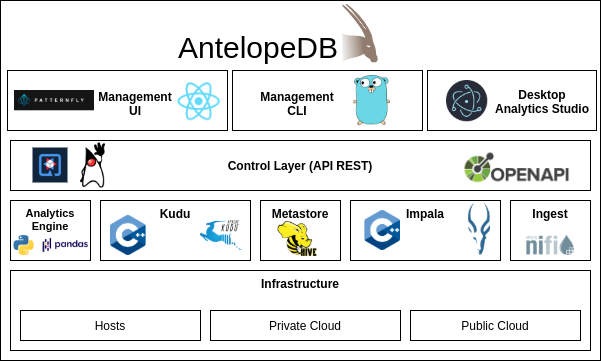

# AntelopeDB Platform
Hybrid Transaction/Analytical Processing (HTAP) Database Platform

## License

AntelopeDB is licensed under the [Apache License, Version 2.0](http://www.apache.org/licenses/LICENSE-2.0).

For additional information, see the LICENSE and NOTICE files.

## Usage

### Minimum Requirements
* JDK 11
* Apache Maven 3.8.2

### Building

Run `mvn clean install` or for parallel build execute `mvn -T 2.0C clean install`. 

Run `mvn clean install -DskipTests` to skip unit test execution.

If you wish to enable style and license checks, specify the contrib-check profile:

`mvn clean install -Pcontrib-check`

---

Licensed to the Apache Software Foundation (ASF) under one
or more contributor license agreements.  See the NOTICE file
distributed with this work for additional information
regarding copyright ownership.  The ASF licenses this file
to you under the Apache License, Version 2.0 (the
"License"); you may not use this file except in compliance
with the License.  You may obtain a copy of the License at

  http://www.apache.org/licenses/LICENSE-2.0

Unless required by applicable law or agreed to in writing,
software distributed under the License is distributed on an
"AS IS" BASIS, WITHOUT WARRANTIES OR CONDITIONS OF ANY
KIND, either express or implied.  See the License for the
specific language governing permissions and limitations
under the License.

