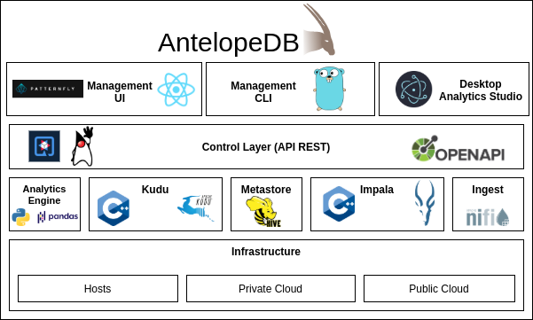

# AntelopeDB Proposal

Hybrid Transaction/Analytical Processing \(HTAP\) Database Platform

Analytical Massively Parallel Processing \(MPP\) Database and Operational Database, OLAP + OLPT = HTAP. Initial features.

* Graphical user interface \(based on ReacJS, using Partternfly and Quarkus as Java backend\). This is the AntelopeDB Manager and AntelopeDB User UI.
* With AntelopeDB Manager the HTAP database can be installed in the following run times:
  * Baremetal or VM
  * Baremetal Kubernetes.
  * Azure, Amazon, Google Cloud in VMs using Terraform.
  * Any kubernetes as a Service from Public Clouds using Terraform.
* The underneath technology \(or core technology\):
  * Apache Kudu + Apache Impala.
  * Apache NiFi for on-line ETL \(managed by API and with the AntelopeDB Manager\).
  * Apache Atlas and Apache Ranger for governance and authorization \(pending to define\).
  * Analytical Framework Dask with Pandas.
  * Jupyter notebooks \(to define\).
* Enterprise features:
  * Backup
  * Disaster recovery
  * Multi-Datacenter
  * Multi-Databases 
* AntelopeDB Data Analytics Studio for end users \(only BI users with SQL parser\) using a desktop Electronjs application.
* Support for the PostgreSQL wire protocol v3: [https://www.postgresql.org/docs/current/protocol.html](https://www.postgresql.org/docs/current/protocol.html) 

